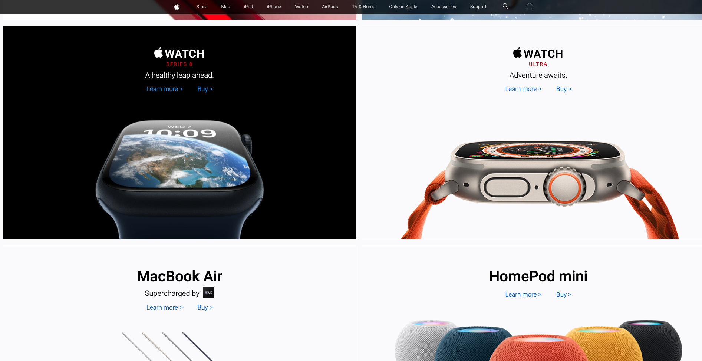
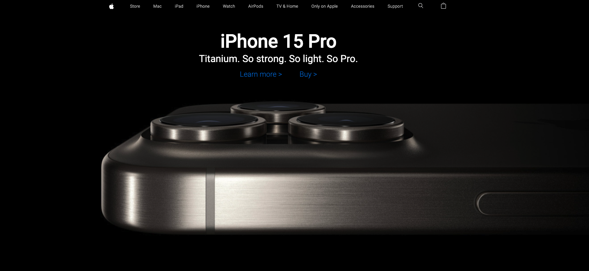
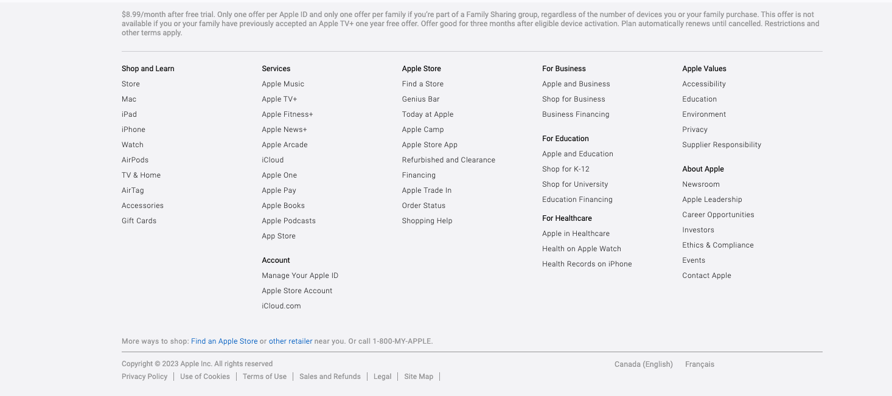
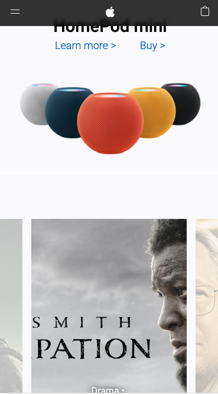
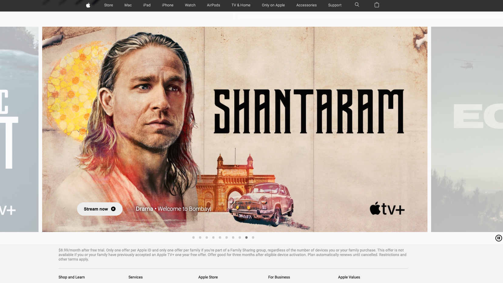

# Clone of Apple Website Main Page

This project is a faithful clone of the Apple website's main page. Its purpose is to showcase the developer's web development skills by replicating the main page's design and functionality. All links and elements on the cloned main page are linked to their corresponding pages on the official Apple website.

## Project Description

### Purpose

The primary objective of this project is to demonstrate the developer's proficiency in web development, specifically in HTML, CSS, and JavaScript. By creating an accurate replica of the Apple website's main page, it serves as a testament to their front-end development capabilities.

### Project Details

- **Clone of Main Page:** This project focuses on cloning the main page of the Apple website, including its layout, design, and content.

- **Functional Links:** Every link and interactive element on the cloned main page is fully functional and connected to the official Apple website. This ensures a seamless transition for users who wish to explore further.

- **Responsive Design:** The project features a responsive design, ensuring an optimal viewing experience on various devices and screen sizes.

- **Custom Carousel:** The image carousel used in this project was implemented without the use of any libraries, demonstrating the developer's coding skills.

## Technologies Used

This project was built using the following technologies:

- **HTML:** Used to construct the structure and layout of the cloned main page.

- **CSS:** Employed for styling to replicate the visual design of the Apple website accurately and to create a responsive design.

- **JavaScript:** Utilized to implement interactive features, including the custom image carousel.

## Usage

To view and interact with the cloned main page:

1. Clone this repository to your local machine.
2. Open the `index.html` file in your web browser.

By clicking on any links or interactive elements on the cloned page, you will be directed to the corresponding pages on the actual Apple website.

## Note

Please be aware that this project is intended solely for educational and demonstrative purposes. It should not be used for commercial purposes or distribution. All intellectual property rights, including the Apple logo, branding, and content, belong to Apple Inc. Always respect copyright and trademark laws when working with brand-related content.

**Note:** Some of the images used in this project are outdated and were taken earlier this year. Please keep this in mind when browsing the content.

## License

This project is provided under the MIT License. Refer to the [LICENSE](LICENSE) file for more details.

## Acknowledgments

This project was inspired by the Apple website, and all credit for the design and branding goes to Apple Inc. We appreciate their inspiration for this project.
